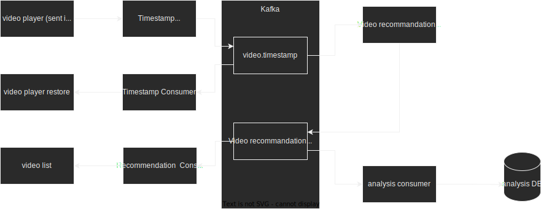
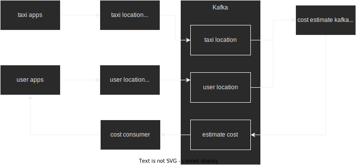
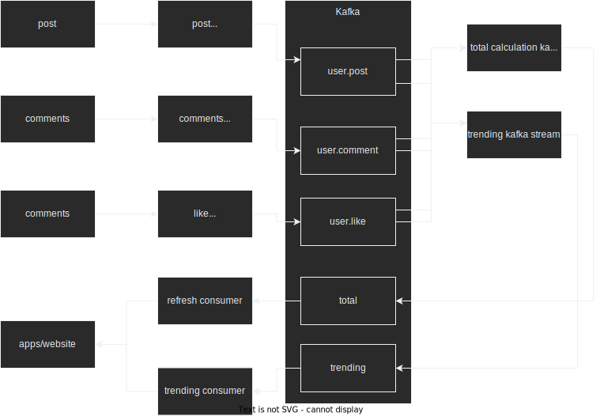
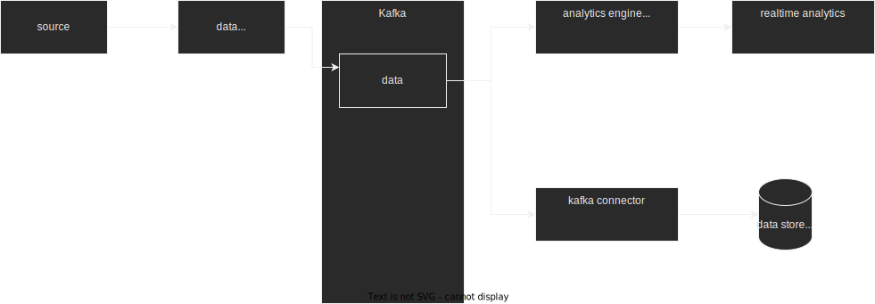

# kafka study
study log for [course](https://www.udemy.com/course/apache-kafka/) from Conduktor

### setup
execute zookeeper
```
zookeeper-server-start /usr/local/etc/zookeeper/zoo.cfg
```

execute kafka server
```
kafka-server-start /usr/local/etc/kafka/server.properties
```

### code
#### basic
basic contains basic java kafka producer and consumer

#### wiki-producer
read event from [wiki recent changes](https://stream.wikimedia.org/v2/stream/recentchange) and produce to topic

#### opensearch-consumer
consumer event from wiki recent change topic and send to open search


### Arhitecture


#### Video system


#### taxi system


#### social media system


#### big data system

